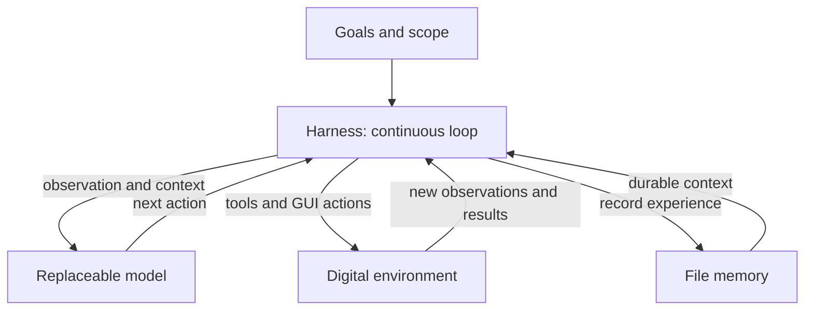
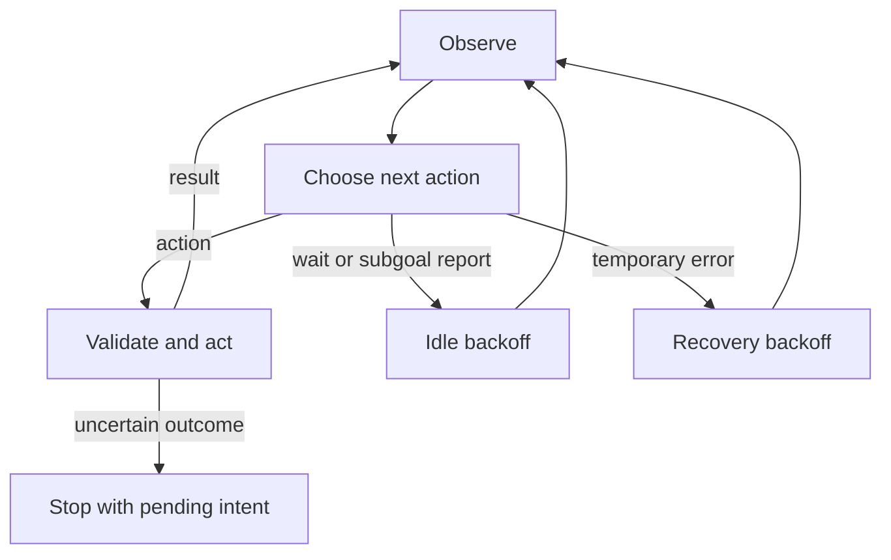

# Conway

**An open architecture for persistent digital agents.**

Model and runtime research toward digital life: an agent that keeps observing,
acting and retaining experience, guided by durable goals.

[中文介绍](README.zh-CN.md) · [Architecture](docs/ARCHITECTURE.md) · [Model research](docs/MODELS.md) · [Get started](docs/INSTALL.md) · [Evidence and limitations](docs/VALIDATION.md)

## The idea

Conway explores a question: **what should we build around a model so that it can
participate continuously in a digital environment?**

Its basic unit is an ongoing action loop. The owner defines goals and scope;
the model chooses the next action from observations and memory; the runtime
executes it, records the result and brings new evidence into the next decision.
Useful work can continue across subgoals without a new conversation turn.

The long-term research goal is digital life: agents that develop more capable
behavior through experience, adapt to changing environments and eventually
support measured continual learning and recursive improvement. Today's work
builds the running architecture and the experimental path toward that goal.

## How the architecture fits together



| Part | What it contributes |
|---|---|
| Goals | `constitution.md` defines identity and scope; `goals.md` holds ongoing work and is reread each cycle. |
| Model | A local or external visual policy interprets the environment and selects the next action. |
| Harness | One continuous loop handles observation, action validation, execution, results, recovery and lifecycle controls. |
| Environment | GUI, files and Shell provide direct interaction; optional MCP tools and Agent Skills connect existing capabilities. |
| Memory | Markdown, JSON and JSONL retain progress, decisions and results across context windows and restarts. |

The default architecture has one acting model and one loop. It runs without a
chat window. Its core stays small so more capable models can take on more of the
reasoning while reusing the same tools, memory and runtime boundaries.

## Two development tracks

**Conway Runtime** is the executable harness. It provides continuous operation,
computer and tool interfaces, file memory, lifecycle controls and independently
checkable task reports. It is the environment in which policies can be tried.

**Conway Policy** is the model research track. Existing open VLMs are the starting
point. Optional visual episodes, independent review, dataset export and an
experimental offline fine-tuning script create a path from experience to
candidate policies. Model and harness revisions can be compared separately.

The action loop is implemented. The learning path is under development: current
adapters run inference, and the optional feedback interface is available for
future stateful or learning models. Candidate evaluation and replacement are
separate experimental steps.

[Runtime semantics](docs/AUTONOMOUS.md) · [MCP and Skills](docs/ECOSYSTEM.md) · [Model/data workflow](docs/MODELS.md) · [Future model interfaces](docs/FUTURE.md)

## Why build this now?

A useful research foundation can be built before small models reliably handle
long-horizon work. Clear goals, inspectable experience, replaceable policies and
repeatable evaluation make it possible to test each new model against the same
running system. As capabilities improve, Conway can evolve through those
replacement points and measured experiments.

The project welcomes contributors working on small-model tool use, GUI grounding,
reusable tools and skills, experience datasets, and evaluations of retained and
new capabilities.

**Current stage: v0.10.0 research prototype.** The runtime, ecosystem connections,
file memory, experience export and acceptance tools are implemented. Small-model
checks have exposed substantial task-reliability gaps. Conway-trained weights,
online learning and recursive self-improvement are research goals, not released
capabilities. See the [measured results](docs/validation/2026-09-26-feedback-recheck.md)
and [digital-life milestones](docs/DIGITAL_LIFE.md).

[GitHub development](https://github.com/jovial-liu/conway) · [Hugging Face source distribution](https://huggingface.co/jnjnkj/conway) · [Configuration](docs/CONFIGURATION.md) · [Changelog](CHANGELOG.md)

## Start

Requires Python 3.11 or newer. In a virtual environment, from this repository:

```sh
python -m pip install -e .
conway init
conway doctor
conway start --mock --max-steps 3
```

The mock command is genuinely offline: synthetic PNG, no VLM download, no desktop permissions, and no computer actions. Keep identity and scope in `constitution.md`; put current work in the `goals.md` path printed by `conway init`. The continuous loop rereads goals each cycle.

For real local inference, install a compatible `llama-server` first. Then:

```sh
conway probe
conway run --observe --max-steps 3
conway run
```

`probe` sends a synthetic PNG and checks the model protocol; it never touches your desktop. `run` executes enabled current-user tools continuously; `run --observe` captures real screenshots and plans without dispatching actions. There is no per-action approval dialog. Set ongoing work in goals.md and scope in constitution.md, then let the agent choose its next actions. Existing constitutions are preserved.

For an existing multimodal server, auto-discover its served model ID:

```sh
conway probe --endpoint http://127.0.0.1:8000/v1
conway run --endpoint http://127.0.0.1:8000/v1
```

With multiple served models, pass `--model` using a returned `/v1/models` ID. An API's model alias need not equal its Hugging Face repository ID.

## Continuous operation

```sh
conway run --quiet
conway status
conway pause
conway resume
conway stop
```

These management commands can run from another terminal; they are not a chat interface. `run` stays in its launching process, opens no UI and never reads stdin. `--quiet` suppresses cycle output; file state and journal remain available. `finish`/OpenCUA `DONE` or `FAIL` records a model-reported subgoal outcome and continues. No success label is inferred from that declaration.

Unchanged idle observations use 2, 4, 8…60-second backoff. After repeated pre-dispatch errors, the agent waits 5, 10, 20…300 seconds and retries from a fresh observation. Stop/pause remain responsive during these waits. By default, three identical side-effect actions are allowed before suppression. GUI counts reset on changed observations; file/Shell/MCP counts survive unrelated screen changes. The latest recorded result or error is shown first in the next decision context. This heuristic is not a general task-success detector.

`--max-steps` and `--max-seconds` optionally bound a run. Explicit stop, Ctrl+C, cooperative SIGTERM, mouse failsafe and uncertain side-effect failures still end execution. There is no automatic respawn after a stop and no boot-service installation. See [autonomous loop semantics](docs/AUTONOMOUS.md) and the [ongoing-constitution example](examples/constitution.autonomous.md).

## Device checks and optional single-session acceptance

```sh
conway preflight --desktop --output ./preflight.json
conway vision-check --samples 8 --seed 42 --output ./vision.json
conway acceptance-check --max-steps 10 --output ./acceptance.json
conway start --task "Create a disposable note and verify its contents" --max-steps 10
conway start --task-file ./task.md --execute --max-steps 30 --max-seconds 300
```

`preflight` checks configuration, the constitution, recovery state, available memory and runtime/model-service readiness. It never downloads weights. `--desktop` adds a time-bounded screenshot check; the temporary image is deleted and is never sent to a model. Input permissions still need a real action test. Without `--desktop`, the report explicitly leaves desktop readiness unchecked.

`vision-check` sends generated color-target images to the configured model and scores the proposed clicks without executing them. Each report includes per-case hits, target bounds, image hashes, latency and model ID. The seed reproduces the suite; this small synthetic check does not measure real application task success. Exit codes: `0` for all targets hit, `2` for misses/errors, `1` for setup errors. Reports must be new files outside the state directory. See [device acceptance](docs/ACCEPTANCE.md).

`acceptance-check` evaluates real-model file creation/readback and one disposable program copy/launch using restricted tools and independent checks. It has no native desktop and does not recursively start agents.

The older `start` command remains for single-session acceptance: a `finish` ends that session, and execution requires `--execute`. Its optional `--task`/UTF-8 `--task-file` is not required or accepted by the continuous `run` entry point. Existing file memory remains intact.

## Runtime design



The constitution and rolling file context guide each decision. Generic JSON VLM and OpenCUA adapters share the action loop. State uses Markdown, atomic JSON and append-only JSONL. Pause/resume/stop and optional time/step budgets control the process.

Conway does not evaluate OpenCUA-generated Python. Its AST parser translates one allowlisted literal call into the same normalized action schema used by the generic VLM. Smart-resized image coordinates are mapped back to screenshot pixels, then to the host input coordinate space. Server-specific processor limits must match the configured OpenCUA pixel limits.

## Operating controls

```sh
conway status
conway pause
conway resume
conway stop
conway config --check
conway models
conway run --max-steps 100 --max-seconds 600
```

Controls are cooperative and scoped to one session. A stop arriving during inference prevents its returned action from dispatching; an in-flight native operation still needs to return. `Ctrl+C` and the PyAutoGUI corner failsafe remain available. `--max-seconds` is not an OS-enforced hard deadline.

An intent record is written **before** a side effect. If the process crashes or dispatch raises after partial work, Conway records an uncertain outcome and does not automatically replay the action. A restarted session obtains a fresh observation. A model's `finish` declaration is recorded separately from independently verified task success.

## Models and hardware

| Profile | Reference | Execution |
|---|---|---|
| `tiny` | `mradermacher/Qwen3-VL-2B-Instruct-abliterated-GGUF` | local GGUF, Q4_K_M |
| `small` | `mradermacher/Qwen3-VL-4B-Instruct-abliterated-GGUF` | local GGUF, Q4_K_M |
| `standard` | `mradermacher/Huihui-Qwen3-VL-8B-Instruct-abliterated-GGUF` | local GGUF, Q4_K_M |
| `computer-use` | `xlangai/OpenCUA-7B` | compatible external multimodal server |

The resolver uses available RAM or free memory on one NVIDIA GPU, reserves headroom, and refuses an estimated non-fitting local model. Apple Silicon uses a unified-memory budget. Memory thresholds are estimates, not measured throughput or guaranteed capacity. AMD/Intel GPU acceleration is not auto-verified; use a compatible external backend or CPU fallback. The runtime binary is not installed automatically.

A community `abliterated` label concerns refusal behavior; it is not a promise of GUI accuracy, reliability, or any specific training method. Referenced weights retain their own upstream licenses.

## GUI and direct tools

Primary-display screenshot, click, double-click, movement, drag, text, key, hotkey and scroll are implemented through PyAutoGUI. HiDPI input mapping is tested with fixtures; monitor rotation, multiple displays, and live OS sessions require device validation. Native Wayland input is not implemented.

Optional read-only accessibility snapshots add foreground-window labels through macOS AX, Windows UIA or Linux AT-SPI. They are disabled by default, run in a time-limited subprocess, and fall back to screenshots on failure. These adapters do not yet provide element-ID actions.

Direct tools provide bounded file reads, atomic text replacement, append, directory listing, browser opening and current-user shell commands. Shell output is bounded and command descendants are cleaned up on timeout. Tool configuration and `--gui-only` are routing preferences, **not a sandbox**: a GUI-capable agent may still operate a terminal under your account.

## File state

```text
CONWAY_HOME/
  constitution.md         owner-defined goals; existing file is preserved
  config.yaml             validated configuration; no API keys
  memory.md               rolling summary
  memory.previous.md      previous summary excerpt
  state.json              current state and pending action
  state.previous.json     recoverable prior state
  control.json            session-scoped control request
  instance.lock           single-instance OS file lock
  journal/*.jsonl          intents, results, errors and recovery events
  screenshots/*.png       bounded recent screenshots
  llama-runtime.log       local inference startup diagnostics
```

Use `CONWAY_HOME`, or put `--home PATH` **before** the subcommand. Memory compaction is bounded by both the configured threshold and the context budget; fallback truncation is explicitly marked. No online weight updates or continual training occur. Journals are retained locally and rotated by size, not silently uploaded.

```sh
conway export --output ./trajectory.jsonl
```

Export excludes dry runs by default, omits image bytes and leaves task-success labels unknown. Review file contents, action text and logs for private information before sharing.

## Development and publication

```sh
python -m pip install -e '.[dev]'
python -m pytest -q
python -m compileall -q src
python -m pip wheel . --no-deps -w dist
```

The test suite exercises parsing, HTTP failures, lifecycle, crash recovery, file/shell I/O, coordinate conversion, UI fallback and a local HTTP fixture-to-tools pipeline. The fixture is not a real model. Existing GitHub CI runs on Linux, Windows and macOS.

HF publication uses a **source snapshot**, not a force-pushed Git history. Tracked source, tests, docs and examples are selected by `scripts/publish_hf.py`; experiment data, runtime state, secrets, binaries and model weights are excluded. `_source_commit.json` records the GitHub commit and per-file hashes and is read back from the HF publication commit. GitHub's existing experiment files and history remain untouched.

## Boundary

Conway runs with the current account's OS permissions. It does not implement OS-permission bypass, privilege escalation, stealth startup or network self-propagation. Do not assume a prompt or config flag provides isolation. Start on a disposable desktop/account and make backups before granting write-capable tools to an autonomous model.

## References

- [OpenCUA-7B model card](https://huggingface.co/xlangai/OpenCUA-7B)
- [llama.cpp multimodal documentation](https://github.com/ggml-org/llama.cpp/blob/master/docs/multimodal.md)
- [llama.cpp server documentation](https://github.com/ggml-org/llama.cpp/blob/master/tools/server/README.md)
- [PyAutoGUI documentation](https://pyautogui.readthedocs.io/en/latest/)
- [Hugging Face upload documentation](https://huggingface.co/docs/huggingface_hub/guides/upload)

MIT for Conway's code; model licenses are separate.
