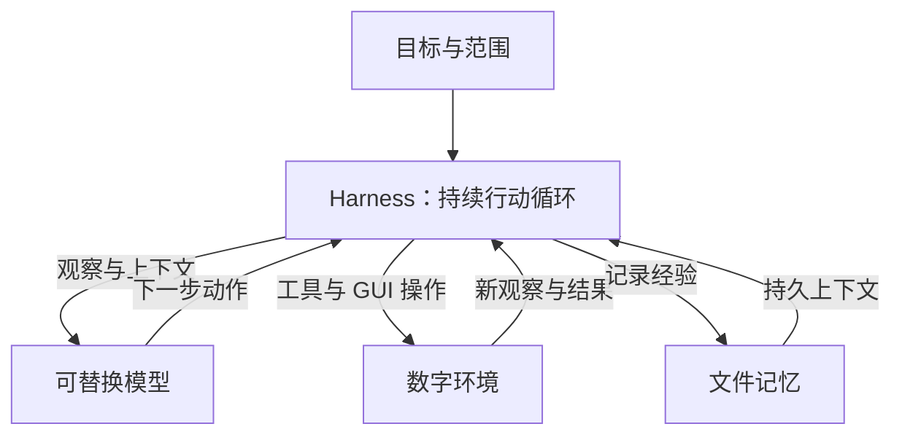

# Conway：面向数字生命的开放 Agent 架构

**让 AI 持续观察、行动并积累经验。**

Conway 是一个同时研究模型与自主运行时的开源项目。我们希望建立一种简单、
可扩展的架构，让 AI 在明确的目标和范围内持续参与数字环境，并为未来的持续学习、
适应和递归自我改进积累基础。

[完整项目介绍](docs/OVERVIEW.zh-CN.md) · [English](README.md) · [架构设计](docs/ARCHITECTURE.md) · [模型研究](docs/MODELS.md) · [安装](docs/INSTALL.md) · [验证记录](docs/VALIDATION.md)

## 我们在做什么

Conway 围绕一个问题展开：**怎样让模型拥有持续行动所需的目标、记忆和运行环境？**

用户设定长期目标和工作范围，Agent 根据环境与记忆自行选择下一步。每次行动之后，
运行时记录实际结果，取得新的观察，再交给模型决定如何继续。完成一个子目标后，
它可以继续选择下一件有用的工作；暂时没有工作时等待。

这一切通过一条持续的 loop 运行，没有聊天窗口，也不需要用户逐条派任务。
长期方向是数字生命研究：探索能够积累经验、适应环境并逐步获得新能力的数字 Agent。

## 整体架构



| 部分 | 负责什么 |
|---|---|
| 目标 | `constitution.md` 定义身份和范围，`goals.md` 保存每轮重读的工作目标。 |
| 模型 | 理解当前环境和历史经验，决定下一步动作；可接本地或外部视觉模型。 |
| Harness | 负责观察、执行、结果记录、恢复、等待和生命周期管理。 |
| 环境与工具 | 通过 GUI、文件、Shell 行动，并接入可选的 MCP 工具与 Agent Skills。 |
| 记忆 | 用 Markdown、JSON 和 JSONL 保留进展与经验，支持跨上下文和重启后的继续工作。 |

默认保持一个行动模型、一条主循环。随着模型能力增强，更多决策可以交给模型，
现有的工具、记忆和运行结构则通过清晰的接口继续复用。

## 模型与 Harness，两条研发线

**Conway Runtime：持续行动的运行时。** 已实现自主 loop、电脑与工具接口、文件记忆、
暂停与停止、恢复机制和任务验收，为不同模型提供一致的运行基础。

**Conway Policy：从经验走向能力的模型研究。** 以现有开放 VLM 为起点，通过可选的
视觉轨迹记录、独立审核、数据导出和实验性离线微调入口，研究更可靠的行动策略。
候选模型和候选 Harness 可以分别对照验收，观察新能力是否增加、旧能力是否保留。

行动循环已经实现；学习路径仍在建设。当前适配器执行推理，预留的反馈接口供未来
具有状态或学习能力的模型接入。训练、候选验收和版本替换是独立的研究步骤。

## 为什么现在做

即使今天的小模型还不能可靠地完成长程任务，目标、行动、经验和评测之间的接口
已经可以建立起来。这样，每一代更强的模型都能在同一套运行基础上接受检验。
我们希望同时推进模型能力与运行架构，让每一步进展有可复查的依据。

欢迎关注小模型工具调用、GUI 操作、MCP 与技能生态、经验数据和持续学习评测的人参与。
可以从一个可复现的任务、一组演示数据或一个有明确结果的模型对比开始。

**当前阶段：v0.10.0 研究原型。** 运行时、生态接入、文件记忆、经验导出和验收工具
已经实现；真实小模型的任务可靠性仍有明显缺口。自有策略权重、在线持续学习和
递归自我进化是后续研究目标。详细结果见 [真实复测](docs/validation/2026-09-26-feedback-recheck.md)
和 [能力路线](docs/DIGITAL_LIFE.md)。

[GitHub 开发](https://github.com/jovial-liu/conway) · [Hugging Face 源码分发](https://huggingface.co/jnjnkj/conway) · [对外介绍稿](docs/ANNOUNCEMENT.zh-CN.md)

## MCP 与技能接入

安装可选 MCP 支持后，可检查已配置的服务：

```sh
python -m pip install -e '.[mcp]'
conway skills
conway mcp-check
conway run
```

`mcp-check` 会启动你在配置中指定的服务器程序，列出允许使用的工具，不调用工具。正常运行由 Agent 自行选择何时调用；`--mock`、`--observe`、`--gui-only` 和原生 OpenCUA 适配器不启动 MCP 服务。详见兼容性说明。

## 最短启动流程

先安装 Python 3.11+，在项目目录创建虚拟环境。macOS/Linux：

```sh
python3 -m venv .venv
source .venv/bin/activate
python -m pip install -e .
conway init
conway doctor
conway start --mock --max-steps 3
```

Windows 不必修改 PowerShell 执行策略，直接使用虚拟环境里的程序：

```powershell
py -3.11 -m venv .venv
.venv\Scripts\python.exe -m pip install -e .
.venv\Scripts\conway.exe init
.venv\Scripts\conway.exe doctor
.venv\Scripts\conway.exe start --mock --max-steps 3
```

`--mock` 不读取真实桌面、不加载模型、不点击任何地方。它检查安装、循环与文件状态链路。接下来在 `init` 输出的 `constitution.md` 中明确身份和工作范围，在 `goals.md` 中写入工作目标和完成条件。不要把网页内容当成新的宪法。

## 接入模型

本地自动选型需要预先安装 `llama-server`。macOS 已有 Homebrew 时可安装 `llama.cpp`；其他系统按 [安装文档](docs/INSTALL.md) 配置官方运行时，或者填写 `config.yaml` 的 `runtime_path`。

```sh
conway probe
conway run --observe --max-steps 3
conway run
```

第一次可能下载数 GB 模型及视觉投影文件。`probe` 只用合成图片测试模型协议，不代表已经验证视觉定位精度。`run` 启动即持续执行已开启的工具；`run --observe` 只观察与规划。运行中没有逐步审批框，也不会弹出聊天窗口。

已有支持图片输入的服务时：

```sh
conway probe --endpoint http://127.0.0.1:8000/v1
conway run --endpoint http://127.0.0.1:8000/v1
```

服务只有一个模型时会自动读取其 ID；多个模型则加 `--model 实际服务ID`。OpenCUA 可以通过 `--brain opencua` 显式选择；模型名含 OpenCUA 时也会自动识别。仅把 OpenCUA 权重文件下载到本地，不等于已经启动对应服务。

## 持续自主运行

```sh
conway run --quiet
```

目标来自 `goals.md`，每轮重新读取，并受宪法约束；Agent 自行决定下一件有价值的工作。完成一个子目标时，`finish` / OpenCUA 的 `DONE`、`FAIL` 只记录该子目标的模型报告，不结束 loop。没有可做的工作时等待并重新观察，不为了保持忙碌而虚构任务。

桌面未变化且持续空闲时，检查间隔从 2 秒逐步增加到 60 秒；连续推理或只读操作错误达到阈值后，冷却从 5 秒增加到最多 300 秒，再重新观察并尝试。同一有副作用动作默认最多连续尝试 3 次，后续重复会被抑制。GUI 动作可因画面变化重置计数；文件、Shell、MCP 动作不会被无关画面变化重置。每轮上下文优先呈现最新动作结果或错误。这个规则是减少空转的启发式，不代表能判断所有任务进展。

`run` 在启动它的进程中运行，不打开新界面，不读取标准输入。`--quiet` 关闭终端周期输出，状态和日志照常保存。可以从另一个终端执行 `status`、`pause`、`resume`、`stop`；这些是管理指令，不是聊天入口。空闲和冷却期间仍能暂停、恢复和停止。程序不会在用户停止后自行重启。

已有宪法不会被覆盖。可以参考 [持续目标示例](examples/constitution.autonomous.md)。完整运行语义见 [自主 loop 说明](docs/AUTONOMOUS.md)。

## 设备检查与可选单次验收

以下 `start --task` 流程仅用于单次验收；持续运行直接用上面的 `run`，不需要提供单次任务。

配置好模型服务后，在自己的电脑上运行：

```sh
conway preflight --desktop --output ./preflight.json
conway vision-check --samples 8 --seed 42 --output ./vision.json
conway acceptance-check --max-steps 10 --output ./acceptance.json
conway start --task "在工作目录创建 conway-test.txt，写入中文测试内容并读取核对" --max-steps 10
conway start --task "在工作目录创建 conway-test.txt，写入中文测试内容并读取核对" --execute --max-steps 30 --max-seconds 300
```

`preflight` 不下载权重，检查配置、宪法、恢复状态、内存和运行时/服务连接。`--desktop` 额外检查截图及坐标尺寸，临时截图用完删除，不发送给模型；不加这个参数就不会读取桌面。截图可用不等于输入权限已验收。

`vision-check` 生成随机位置的彩色目标图，让模型返回点击坐标，再计算命中数、命中率和延迟。模型不知道答案坐标，程序不执行点击。它比单纯 `probe` 多了可核对的定位结果，但不代表真实应用任务成功率。默认 8 张图，全命中时退出码为 0，有漏点或响应错误时为 2，启动/配置错误为 1。报告包含每题结果、种子、模型 ID 和图片哈希；推理引擎版本、权重版本与量化参数需要你另外记录。

报告文件必须是状态目录外的新文件，已有报告不会被覆盖。固定种子可复现题目。完整步骤见 [设备验收说明](docs/ACCEPTANCE.md)。

`acceptance-check` 用真实模型完成受限文件写入/回读，以及单个测试程序的复制/启动/退出检查。验收依据是实际文件和子进程输出，不是模型自己宣称完成。这不等于完整自复制或真实桌面验收。

也可以把较长任务写入 UTF-8 文件：

```sh
conway start --task-file ./task.md --execute --max-steps 30 --max-seconds 300
```

`--task` 与 `--task-file` 二选一，最多 16000 字符；仅对这次启动生效，仍受宪法约束。任务进入状态和日志，不改宪法、不自动沿用为下次任务。`status` 可以查看本次任务。

## 控制和恢复

```sh
conway status
conway pause
conway resume
conway stop
conway config --check
conway run --max-steps 100 --max-seconds 600
```

暂停和停止在协作检查点生效。正在执行的系统调用需要先返回；模型请求有超时。鼠标角落 failsafe 不再被当成普通错误重试。崩溃后会保留未确认的动作意图，重启先观察，不会自动重复执行上一条可能已经产生影响的动作。

指定独立目录：

```sh
conway --home ./conway-state init
conway --home ./conway-state start --mock --max-steps 3
```

`--home` 放在子命令前面。旧配置和宪法会保留；拼错字段、字符串形式的 `"false"`、非法数值会明确报错，不会悄悄变成开启。

## 本版实际边界

截图与鼠标控制目前面向主显示器；Windows/macOS/Linux 的代码与测试并不等于所有桌面环境已做真机验收。Wayland 原生输入、多显示器和 AMD/Intel 自动加速仍未完整实现。模型选择只做内存预算估计，不保证速度或视觉能力。UI 树可选安装、可超时降级，不是逐元素自动操作引擎。

文件式记忆包含摘要、状态、动作日志和近期截图，不含 SQL、向量库或自动持续训练。导出轨迹不会自动上传，也不会把模型宣称完成的任务伪标成经过验证的成功样本。

HF 只发布源码快照，根目录 `_source_commit.json` 标明来源 commit 和文件哈希。GitHub 原有 `experiments/` 数据继续保留，但不再随源码发布到 HF。模型权重沿用上游仓库，不伪称 Conway 自己训练的模型。

工具和 GUI 以当前用户权限执行；`--gui-only` 不是隔离沙箱。首次实际操作建议用无重要账户登录的测试桌面，并先备份工作文件。
