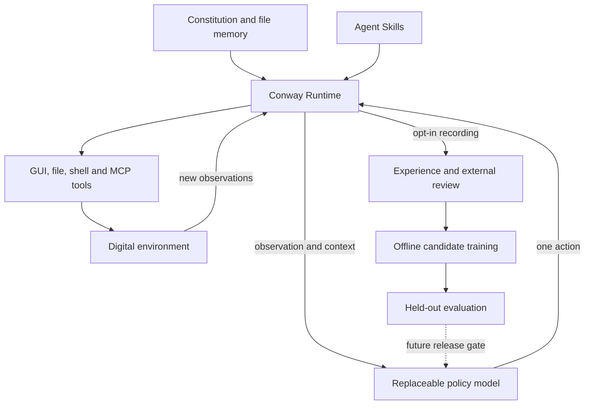

# Conway: models and harnesses toward digital life

[中文项目介绍](OVERVIEW.zh-CN.md) · [Public introduction draft](ANNOUNCEMENT.zh-CN.md) · [Runtime documentation](AUTONOMOUS.md)

Research/design review: **2026-09-26**. The goal is an open research system for persistent autonomous digital agents. Artificial/digital life is the long-term research direction; persistence and tool use alone do not establish life, consciousness, general autonomy or self-improvement.

The public project has two development tracks: **Conway Runtime**, the executable harness, and **Conway Policy**, a planned family of learned visual/action policies. The runtime is released. The policy data/export and experimental LoRA entry point are implemented; no Conway-trained checkpoint has been produced or evaluated by this release.

## What we borrow from mainstream agent engineering

The review used Exa across five workstreams: long-running harnesses, MCP, Agent Skills, agent SDK architecture, and open computer-use models/training. These are design references, not affiliations or claims of benchmark equivalence.

| Official reference | Useful design lesson | Conway decision and actual boundary |
|---|---|---|
| [Anthropic: long-running harnesses](https://www.anthropic.com/engineering/effective-harnesses-for-long-running-agents) | Durable progress artifacts and verified incremental work matter across context boundaries | Keep constitution, state, memory and intent/result journals on disk; a model's finish report is not proof |
| [Anthropic: harness design, March 2026](https://www.anthropic.com/engineering/harness-design-long-running-apps) | Separate generation from evaluation; scaffolding should fit the model and task | Keep one acting policy initially, use separate evidence/review for training and releases; multi-agent scheduling remains future work |
| [OpenHands SDK architecture](https://docs.openhands.dev/sdk/arch/overview) | Models, tools, workspaces and interfaces need clear boundaries | Keep Brain, ToolExecutor, Computer and file state separable; a chat interface is not required |
| [MCP tools specification](https://modelcontextprotocol.io/specification/2026-07-28/server/tools) and [official Python client](https://py.sdk.modelcontextprotocol.io/client/index.md) | Tool discovery, schemas and invocation can be model-independent | Implement official SDK 2.2 stdio clients and explicit tool allowlists; no custom pseudo-MCP protocol |
| [Agent Skills specification](https://agentskills.io/specification) | Discover short metadata first; load instructions/resources only when needed | Read local SKILL.md packages progressively with bounded pages; no automatic installation or script execution |
| [OpenCUA](https://opencua.xlang.ai/) | Computer-use progress requires model, state/action demonstrations and evaluations together | Preserve the native OpenCUA adapter; add an image/action data path for Conway's generic policy |
| [Qwen3.5-0.8B model card](https://huggingface.co/Qwen/Qwen3.5-0.8B) and [TRL VLM SFT](https://huggingface.co/docs/trl/sft_trainer) | A small open multimodal foundation can support task-specific policy research | Start the experimental training recipe from an official base; keep base-model revision and dataset provenance explicit |

Conway does not embed those agent frameworks wholesale. MCP and Agent Skills provide ecosystem entry points while preserving a small Python runtime and file-only persistence. This is our engineering judgment, not a claim that one design dominates all alternatives.

## Model, runtime, environment, experience

| Layer | Responsibility | Current implementation |
|---|---|---|
| Policy/model | Interpret observations and choose the next normalized action | Generic image/JSON VLM and native OpenCUA adapters; existing external/local weights |
| Runtime/harness | Schedule observations, validate actions, preserve intent/results, idle/recover and stop | Continuous `conway run`; file state; pause/stop; bounded repeated-action guard |
| Capabilities | Execute tools and load reusable procedures | Desktop, file/Shell, optional MCP stdio tools, local Agent Skills |
| Experience | Preserve exact visual context, action, result and review provenance | Opt-in closed episodes, hashes, external-review requirements, dataset export |
| Learning | Produce and compare new candidate policies | Experimental offline LoRA script; data validation tested, GPU training unperformed |
| Release | Select a policy based on reproducible evidence | Evaluation proposal and device checks; no automatic checkpoint promotion |

An autonomous runtime should act without per-turn conversation. Its scope comes from the constitution and its current objectives from hot-read goals.md. Stop is a lifecycle command; completion is a subgoal report. No input box, chat queue or stdin prompt is introduced by ecosystem support. MCP elicitation/sampling is not exposed as a user-conversation channel.

## Making the digital-life goal measurable

These are proposed research criteria, not achieved capabilities or a scientific definition of life.

| Criterion | Evidence to collect | Status |
|---|---|---|
| Continuity | Retain useful state across context resets and restarts without replaying uncertain effects | File persistence and recovery implemented; long-duration efficacy unmeasured |
| Autonomous activity | Complete multiple useful subgoals without new chat turns | Scheduling semantics tested; real-model multi-goal success unmeasured |
| Environmental grounding | Verify actual files, UI states and task results | Tool observations and visual checks implemented; broad task suite needed |
| Resource regulation | Useful progress per unit time, energy, tokens and memory | Time/step limits and idle backoff implemented; token/energy accounting planned |
| Learning from experience | A candidate improves held-out tasks without erasing earlier skills | Data pipeline implemented; no measured learned improvement |
| Adaptation | Recover from new layouts, tool changes and interrupted tasks | Some runtime recovery implemented; model generalization unmeasured |

Perpetual activity, self-replication and self-modification are not used as substitutes for these measurements. A process can wait when there is no useful work and stop when asked, while still supporting research into persistent agency.

## Next model/harness milestones

1. Collect licensed, privacy-reviewed demonstrations on controlled real desktops; include errors and recoveries in research data, but do not train failed actions as successful demonstrations.
2. Run the small-policy training recipe on a recorded base revision. Publish a model card, dataset manifest, training environment and measured limitations with any candidate weights.
3. Compare a fixed base model under a minimal loop and Conway Runtime; then compare the trained model under both harnesses. This separates model improvement from extra prompting/tools.
4. Evaluate unseen tasks, applications and interruption points. Group related tasks by environment/template in addition to episode-level splitting; current export only enforces episode and exact-image separation.
5. Add explicit goal selection, retrieval/consolidation, resource accounting and longer-horizon learning only when ablations demonstrate benefits. Online weight changes, population experiments and multi-agent ecologies remain research proposals.

## Public positioning

English: **Conway — an open architecture for persistent digital agents.**

中文：**Conway：面向数字生命的开放 Agent 架构。**

The short explanation is: a persistent agent that observes, acts and accumulates inspectable experience without a chat window, with an open path from experience to candidate policies. Release materials should identify runtime version, base model, evaluation setting and whether weights are actually available. Avoid “already alive,” “self-evolving,” “fully autonomous in any environment,” or borrowed benchmark scores without corresponding evidence.
