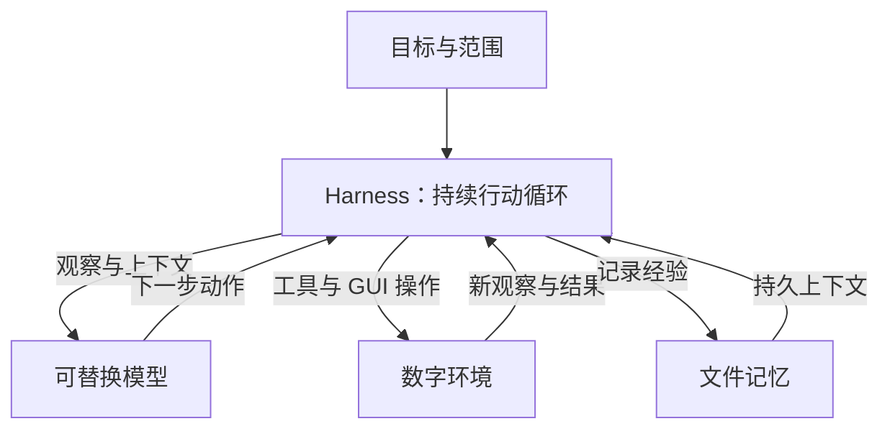

# Conway：为持续行动的 AI 构建开放架构

**Conway 是一个面向数字生命研究的开源项目，同时推进模型与自主运行时。**
它把目标、模型、工具、环境和记忆连接起来，让 Agent 可以持续观察、行动、
记录结果，并在下一轮决策中使用这些经历。长期目标是研究能够持续学习、
适应环境和递归改进的数字 Agent。

## 一个持续活动的系统

Conway 的基本运行单位是一条自主循环。用户先定义目标和工作范围；模型根据
当前环境与记忆选择下一步，运行时执行动作、记录结果，再取得新的观察。
一个子目标结束后，循环继续；没有有用工作时，系统等待并重新观察。

目标可以写在 Markdown 文件里，在运行期间调整。Agent 的行动由模型选择，
整个系统没有聊天窗口。用户通过目标、配置和生命周期管理控制运行。

可以用“在指定工作目录中持续推进一个研究项目”理解这一设计：它需要保留
未完成事项，检查已有产物，选择下一步，观察执行结果，再决定继续、修正或等待。
这个场景描述架构希望支持的行为；实际完成质量仍取决于模型，并由任务验收衡量。

## 五个部件，清楚分工

**目标确定方向。** 稳定的身份和范围放在 `constitution.md`，正在推进的工作
放在 `goals.md`。持续循环每轮读取目标，让长期方向和当前行动保持联系。

**模型负责决策。** 模型接收观察、目标和历史结果，选择下一步动作。当前支持
本地或外部视觉模型，通过适配器接入；模型可以更换，行动接口保持清晰。

**Harness 负责运行。** Harness 是承接模型、工具和状态的运行时。它获取观察，
检查和执行动作，记录结果，并处理等待、错误、暂停、停止和恢复。默认只有一个
行动模型和一条主循环，便于理解、调试和比较。

**环境提供真实反馈。** Agent 可以操作文件、执行 Shell、使用 GUI，也可以接入
已配置的 MCP 工具，按需读取 Agent Skills。文件变化、命令输出和新截图共同构成
下一轮决策的依据。

**记忆保留经历。** Markdown、JSON 和 JSONL 保存目标、进展、运行状态和行动日志。
这些文件便于查看和迁移，也为后续研究哪些经验真正有用提供材料。

## 为什么同时研究模型与 Harness

模型决定系统能理解什么、怎样规划和怎样行动。Harness 决定模型每次能看到哪些
信息、怎样接触环境，以及经历如何保留下来。两部分会共同影响最终行为。

因此，Conway 有两条研发线：

| 研发线 | 当前建设 | 长期方向 |
|---|---|---|
| Conway Runtime | 自主循环、工具与 GUI、文件记忆、恢复和验收 | 保持精简，为更强的模型持续提供运行基础 |
| Conway Policy | 现有开放 VLM 接入、视觉轨迹、独立审核、数据导出和实验性微调入口 | 从经验中获得更可靠、更可迁移的行动能力 |

研究时可以固定模型比较 Harness，也可以固定 Harness 比较模型。这样才能知道
进步来自模型、工具、上下文组织还是其他因素，并检查旧能力是否保留。

## 为未来能力留下接入点

Conway 已有可选反馈接口，可向未来的学习适配器提供执行过的动作、工具结果和
前后观察。当前推理适配器不会因此更新权重。视觉经验也可以通过可选记录、审核
和数据导出进入离线研究流程。

未来的持续学习或递归改进，需要真实模型机制、可信数据和独立验收共同成立。
我们的架构方向是保留这些接入点：让候选模型与候选代码有清楚的版本、实验和结果，
再用可复查的证据决定下一步。更强的未来模型能否实现这一目标，需要届时验证。

## 今天可以怎样参与

Conway 通过 MCP 和 Agent Skills 接入已有工具与技能生态，使用现有开放视觉模型
开展策略研究。贡献可以落在一个明确的部件上：

- 提交真实任务及可核对的成功条件，复现模型在哪一步失败。
- 改进小模型的工具调用、结果验证或 GUI 定位能力。
- 提供有许可、经过隐私检查的演示与恢复轨迹。
- 接入有实际用途的工具或技能，并记录兼容性。
- 研究经验迁移、旧能力保持和长时间运行的评测方法。

当前 v0.10.0 是研究原型，运行时与经验、验收工具已实现。真实小模型仍存在明显的
任务可靠性缺口；自有策略权重、在线持续学习和递归自我进化尚未实现。
项目公开保留失败结果，让参与者能看清已有基础和下一步问题。

[GitHub](https://github.com/jovial-liu/conway) · [Hugging Face 源码](https://huggingface.co/jnjnkj/conway)

[开始使用](../README.zh-CN.md) · [技术架构](ARCHITECTURE.md) · [模型研究](MODELS.md) · [验收证据](VALIDATION.md) · [数字生命研究路线](DIGITAL_LIFE.md)
